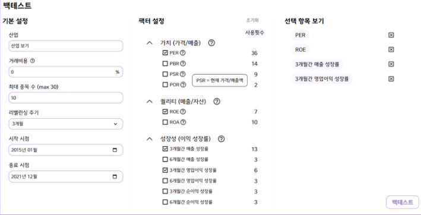
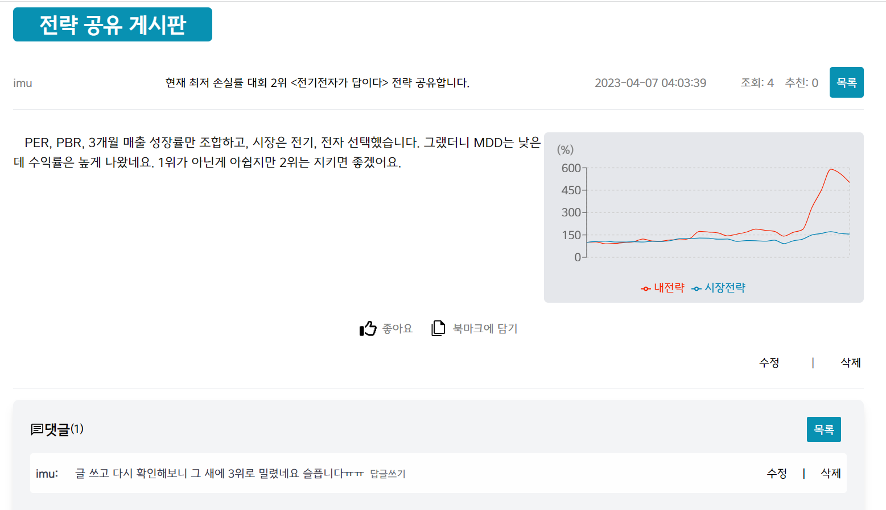
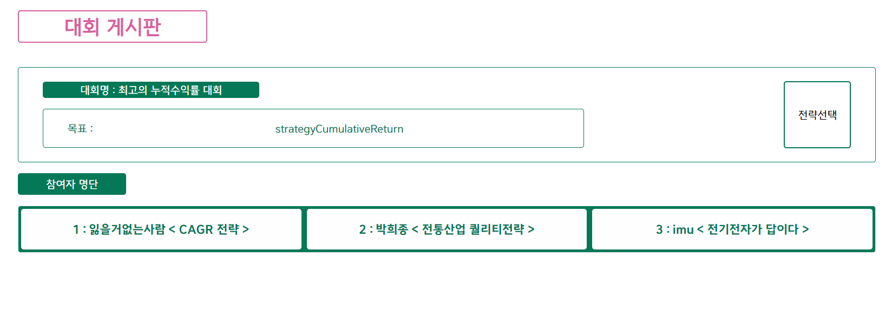
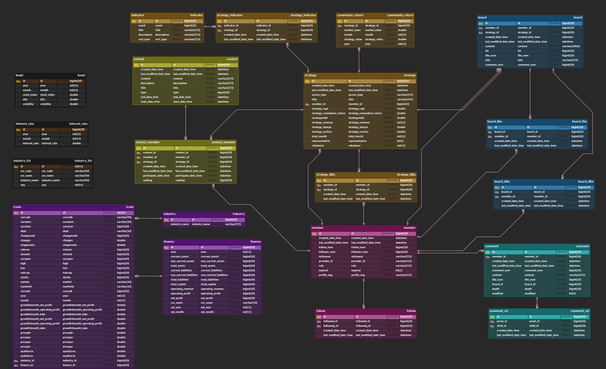

# 주마등(주식을 마주하는 등대)

## <u>프로젝트 소개</u>

'주마등'은 '주식을 마주하는 등대'의 줄임말입니다. 등대가 어두운 바다에 빛을 밝혀 배가 안전하게 항해할 수 있도록 돕듯이, 이용자가 안전하게 주식 시장에 입문할 수 있도록 돕고자 하는 마음을 담았습니다.   

### 기획 배경

2020년 COVID-19 팬데믹 이후 자산 가격이 급등하면서 국민 5명 중 한 명이 주식을 시작했으며, 그 중 절반이 2030 세대였다고 합니다. 당시 2030 투자자 사이에서는 '빚투'와 '영끌'이 유행했습니다. COVID-19가 종식되어 가고 있는 2023년 현재, 결과는 어떨까요? 한 기사에 따르면, '빚투'·'영끌' 했던 청년 4~5명 중 한 명은 소득의 3배에 달하는 부채를 안고 있다고 합니다.  
저희는 주식을 처음 시작하는 2030 또래들이 쉽고, 안정적인 방법으로 주식 시장에 참여할 수 있는 방법을 안내합니다.    

### 퀀트 투자

 **퀀트 투자**는 주식 투자 방법론의 일종으로, 객관적 수치 지표를 바탕으로 매매 전략을 세워 투자하는 방법입니다. PER, PBR 등 지표들을 조합해 '전략'을 세우고, 일정 주기마다 그 전략에 일치하는 종목들을 매매합니다. 특히 과거 주식시장 기록을 통해 모의 투자를 진행해 결과를 확인하는 '백테스트' 방식으로 결과를 예측해볼 수도 있습니다. 또한, 정해진 기간마다 정해진 조건에 따라 매매하므로 '언제 사서 언제 팔아야하지?'라는 고민을 하지 않아도 됩니다. 여러 종목에 투자하므로, 한 종목에서 큰 손해가 발생해도 다른 종목에서 손해를 줄일 수 있습니다. 이러한 이유를 바탕으로 저희는 퀀트 투자가 주식을 쉽고 안전하게 시작할 수 있는 방법이라고 생각했습니다.    
 '주마등'은 이용자가 퀀트 투자를 통해 주식에 입문할 때 필요한 정보와 기능을 제공합니다. 이용자는 사이트 내에서 쉽게 자신의 투자 전략을 세우고, 백테스트를 통해 전략을 검증할 수 있습니다. 또한 서로 전략을 공유해 더 좋은 전략을 수립하는 발판으로 삼을 수도 있습니다.    

## <u>주요 기능</u>

### 메인 페이지

- 카카오 소셜 로그인을 통한 회원가입    

### 백테스트

- 지표에 대한 설명, 지표를 사용한 전략 수 표시
- 2000년 ~ 2022년 기간 동안 KOSPI 거래 기록과 상장 기업들의 재무 정보를 기반으로 백테스트를 실행합니다.    

### 결과 페이지

- 동 기간 시장 대비 수익률, 최고 수익과 최고 손해액 등 전략 판단에 도움이 될 지표들을 그래프와 표로 제공합니다.  

### 전략 공유 게시판

- 자신의 전략을 첨부하여 글을 작성할 수 있습니다.
- 첨부된 전략의 결과를 같이 조회할 수 있습니다.
- 첨부된 전략에 사용된 지표를 이용해 바로 백테스트를 진행할 수 있습니다.  

### 대회 게시판

- 높은 수익률, 낮은 위험도 등 특정 조건에 맞는 대회를 진행합니다.
- 참여한 전략들의 순위와 결과를 확인할 수 있습니다.  

## <u>기술 스택</u>

**Backend - Spring**

- IntelliJ IDE
- Springboot Gradle 7.4
- Java jdk corretto 11.0.17
- Spring Data JPA
- Springframework 2.7.9
- Spring Security
- Spring Validation
- Spring Web
- Swagger 3.0.0
- Lombok
- spark-core 2.12:3.3.2
- spark-sql 2.12:3.2.3
- jjwt 0.11.2

**Backend - DB**

- MariaDB 10.11.2

**Backend - Spark**

- Spark 3.2.3
- Hadoop 3.3.4

**Frontend - React**

- Visual Studio Code IDE 1.74.2
- Nodejs 18.12.1
- React 18.2.0
- zustand 4.3.6
- typescript 4.9.5
- TailwindCss 3.2.7

**CI/CD**

- AWS EC2
  Ubuntu 20.04
  Docker 23.0.1
- Jenkins
- NGINX
- SSL
    

## 외부 서비스

-   OAUTH2(kakao):
  
         client-id: 6cc5ec0c050089526ff7be1c676eff66
         client-secret: SkPr4qmOSB2pOUBRKhA5RzXEzsTMLhYh
         redirect-uri: http://j8d207.p.ssafy.io/login/oauth2/code/kakao
         authorization-grant-type: authorization_code
         client-authentication-method: POST
         client-name: Kakao
         scope:
           - profile_nickname
           - account_email
           - profile_image
  
   

## 빌드시 환경변수

- spring : java -jar -Dspring.profiles.active=server app.jar (yml 프로파일 지정)
    

## <u>ERD</u>

  

# <u>개발 팀 소개</u>

- FE : 김현진, 하진우
- BE : 강교철, 박희종, 임지원, 임유정
